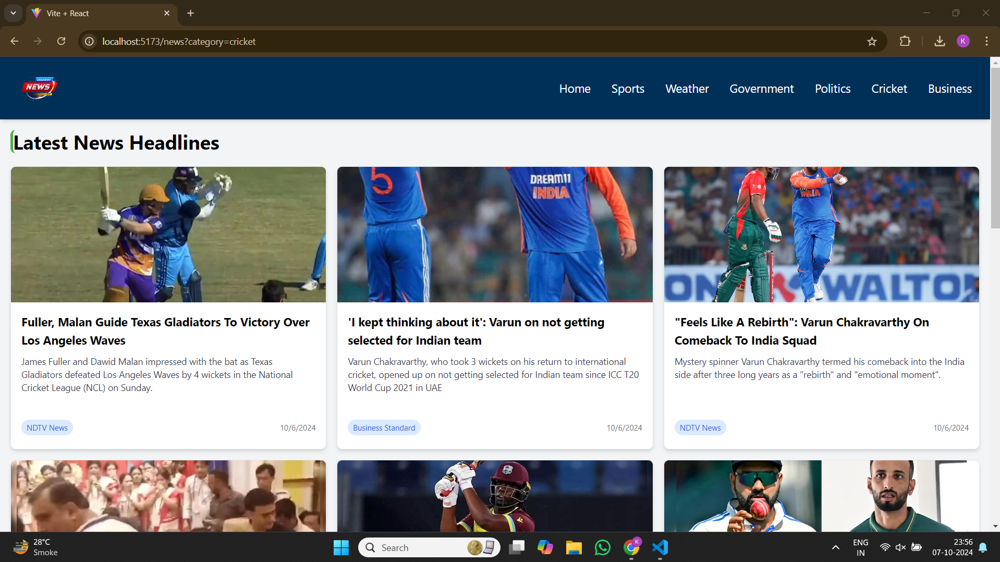

# 📰 News Headline Website

This project is a news website that integrates the [News API](https://newsapi.org/) to display real-time headlines. It includes section-wise categorized news such as sports, Bussiness, politics, and government, offering users a rich browsing experience. Built using **React** with **Vite**, **Tailwind CSS**, and **Axios**.

## ✨ Features
- **Real-Time News**: Fetches and displays the latest news headlines.
- **Category-Based News**: Separate sections for different news categories such as Sports, Education, Politics, etc.
- **Responsive Design**: Fully responsive layout using Tailwind CSS.
- **Enhanced Error Handling**: User-friendly messages in case of API failures.
- **Modern UI**: Stylish design with React Icons and Tailwind CSS utilities.
  
## 📚 Tech Stack
- **Frontend**: React (Vite)
- **Styling**: Tailwind CSS
- **Data Fetching**: Axios

## 🚀 Getting Started

Follow these steps to set up and run the project locally.

### Prerequisites

- [News API Key](https://newsapi.org/) (Sign up to get an API key)

### ⚙️ Installation

1. **Clone the Repository:**

   ```bash
   git clone https://github.com/Kuldeepatel/RevoltronX-Assignment.git
   ```

2. **Navigate to the Project Directory:**

   ```bash
   cd Frontned
   ```
3. **Set Up Environment Variables:**

  Create a .env file in the root of your project and add your News API key:

  ```bash
  NEWS_API_KEY=your_news_api_key
  ```
  Replace your_news_api_key with the API key you obtained from News API.

4. **Install Dependencies:**

   ```bash
   npm install
   ```


### 🏃 Running the Project

1. **Start the Development Server:**

   ```bash
   npm run dev
   ```

   This will start the Vite development server. Open your browser and navigate to:

   ```
   http://localhost:3000
   ```

### 🛠️ Usage

- **NewsPage**: Displays the top 10 latest news headlines.
- **NavBar**: Use the navbar to switch between categories.
- **Error Handling**: If the News API is unreachable or the request fails, a friendly error message is shown.

### 🔧 Dependencies

- **React**: JavaScript library for building user interfaces.
- **Vite**: Blazing fast frontend tool for modern web development.
- **Tailwind CSS**: Utility-first CSS framework for fast styling.
- **Axios**: Promise-based HTTP client for making requests.
- **React Icons**: Library of popular icons for React applications.
- 
### Picture of Website
- **Laptop and Desktop Screen**
- 

- **Tablet Screen**
- [Tablet Screenshot](./Tablet Screenshot.png)

